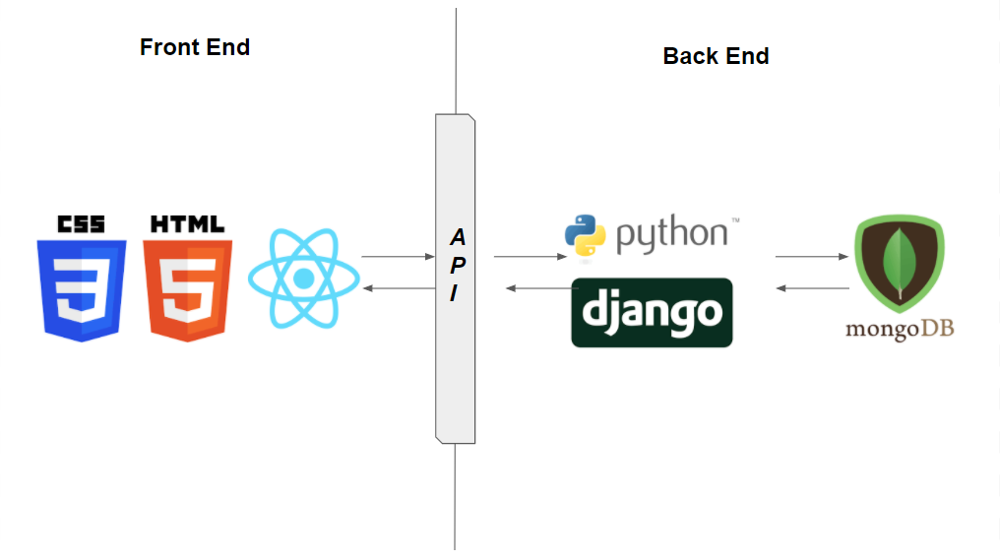

# SpareWare Backend
## Goal :
Build an E-Commerce website for selling Electronics and Mechanical equipments. 

## Tech Stack :

Front End : HTML, CSS, React.js

Back End : Python Django 

Database : MongoDB 

## Prerequisites :
(To be added)

## Developement :
(To be added)

## Steps to setup local dev environment :
(To be added )

## Team :

Atharva Kulkarni

Vivek Mankar 

Rudreshwar Warkhade 

Nisarg Mehta 

Sumeet Karmankar 

## Developer Guidelines
### where to start?

1. git clone the main repository.
2. Create a branch named as story number, for Ex. ANRSV-001
3. Start working on the assigned ticket

### Merging a PR 
1.Before merging a PR :

  The PR should be reviewed by at least 1 or 2 developers
  
2. Merge a PR to develop branch 
#### Note: DO NOT push anything directly into master.

### How to start working on a story?

1. At the beginning of the week, The team will discuss and assign every developer a new story in the Weekly kick-off call

2. Developers start working on the story 

3. After your initial commit to the branch, create a pull request(PR) into the upstream Github repo develop branch

Check out : https://docs.github.com/en/enterprise/2.16/user/github/collaborating-with-issues-and-pull-requests/creating-a-pull-request-from-a-fork

4. Name the PR as  “DRAFT: story number”. For example, “DRAFT:  ANRSV-001“

#### 4. Benefits of creating a draft PR are

A. If you need help on the story, other developers can easily view your changes and help you

B. If for any reason, you cannot continue on the story, another developer can up the story from where you left

#### Once, you have finished your story and made sure everything is working as expected, 
#### rename the PR to “Ready for review: story number”, for Ex, “Ready for review: ANRSV-001“

